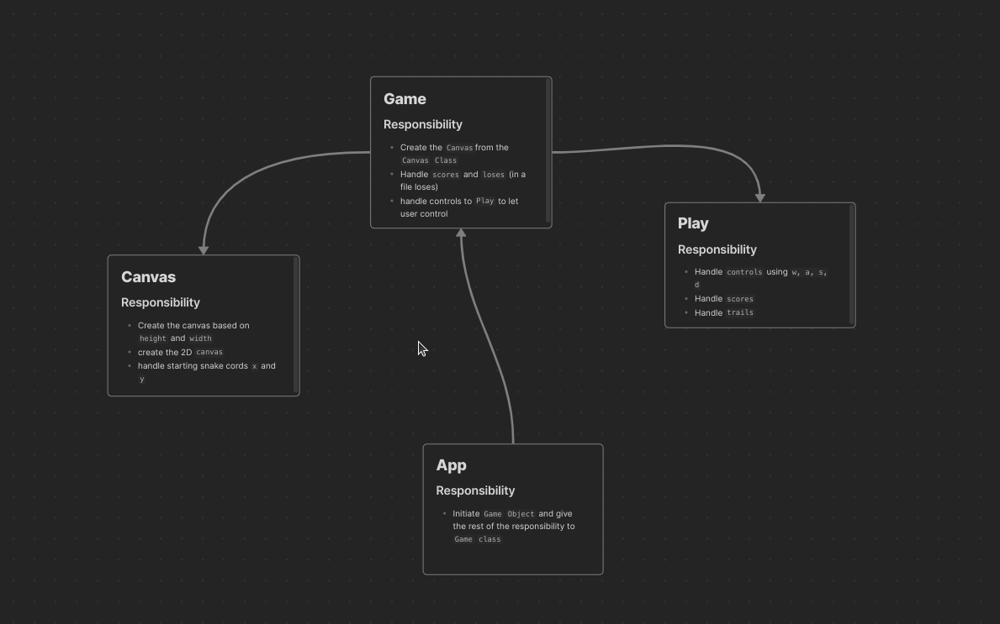

# Snake

This is a project written in `C++`. This project represents a fast pased `Snake` Console based application where it will be more upgraded,

## Project Structure

```bash
.
├── bin
├── lib
├── main
├── psudo
└── test
```

## How To Contribute

In Order to contribute to this open source project create a pull request with a better feature or resolved bug.

## How to Submit Issue

If you find any issue with this project then create issue with `bug` label and provide clear explanation of the bug with trace

## Feature request

If you thinkg `x`, `y`, `z` etc feature should be added then create a issue with `enhancement` or open a discussion about it.

## Don't understand lables
See the label [documentation](./labels.md) to understand what the label means. 

## Diagram



## Thank you.

